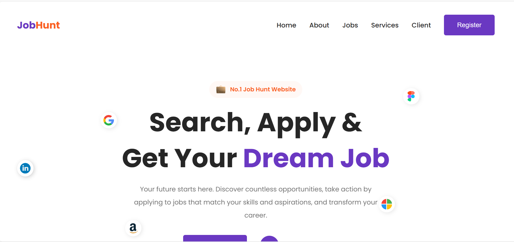

# 💼 JobHunt – Job Search & Recruitment Website  

**JobHunt** is a modern and responsive job search and recruitment website designed to connect job seekers with top companies.  
The platform allows users to explore job opportunities, browse categories, view company listings, and understand the hiring process through a clean and user-friendly interface.  
Built using HTML, CSS, and JavaScript, JobHunt focuses on usability, performance, and elegant UI design.

---

## ✨ Features  

- 🏠 Hero section with trusted company logos  
- 🔍 4-step hiring process guide  
- 🧭 Job categories across multiple industries  
- 💼 Latest and top job openings  
- 🎁 Career services and offerings  
- 💬 Client testimonials slider  
- 📱 Fully responsive design  
- ✨ Smooth animations and interactions  

---

## 🖼 Demo  

👉 Live Demo: #  

---

## 🛠️ Tech Stack  

- HTML5  
- CSS3  
- JavaScript (ES6)  
- Remix Icon  
- Swiper.js  
- ScrollReveal.js  

---

## ⚙️ How to Use  

1. **Clone the repository** 

git clone https://github.com/fsafiya187/JobHunt.git

2. **Navigate to the project folder**

cd JobHunt

3. **Open in browser**

Open index.html

---

## 📚 Learning Highlights

Job portal UI design

Card-based layouts

Swiper slider integration

Scroll animations

Responsive web design

---

## 🧾 License

This project is licensed under the MIT License.

---

## 💬 Author

Safiya Fathima
GitHub: fsafiya187